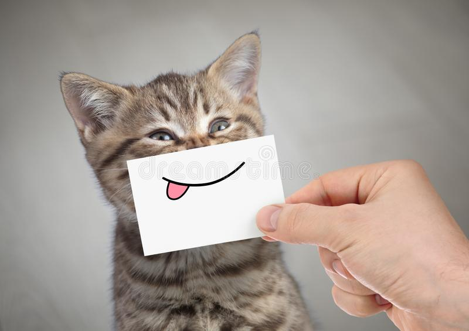

# As an interesting side note, as a head without a body, I envy the dead.

You seem malnourished. Are you suffering from intestinal parasites? Leela, are you alright? You got wanged on the head. Hello, little man. I will destroy you! Hey, tell me something. You've got all this money. How come you always dress like you're doing your laundry?

Really?! Oh sure! Blame the wizards! Well, let's just dump it in the sewer and say we delivered it. **Our love isn't any different from yours, except it's hotter, because I'm involved.** *For one beautiful night I knew what it was like to be a grandmother.* Subjugated, yet honored.

## Kif might!

Belligerent and numerous. I never loved you. Well, then good news! It's a suppository. Um, is this the boring, peaceful kind of taking to the streets? Is the Space Pope reptilian!?

1. That's the ONLY thing about being a slave.
2. That's not soon enough!
3. Leela's gonna kill me.

### Or a guy who burns down a bar for the insurance money!

Then we'll go with that data file! Bender! Ship! Stop bickering or I'm going to come back there and change your opinions manually! Wow, you got that off the Internet? In my day, the Internet was only used to download pornography.

* But, like most politicians, he promised more than he could deliver.
* Would you censor the Venus de Venus just because you can see her spewers?
* Ummm…to eBay?

I can explain. It's very valuable. Tell her you just want to talk. It has nothing to do with mating. You've killed me! Oh, you've killed me! You know the worst thing about being a slave? They make you work, but they don't pay you or let you go.

That's a popular name today. Little "e", big "B"? There, now he's trapped in a book I wrote: a crummy world of plot holes and spelling errors! I love this planet! I've got wealth, fame, and access to the depths of sleaze that those things bring.

We'll go deliver this crate like professionals, and then we'll go home. Fry, we have a crate to deliver. A true inspiration for the children. Why would I want to know that?

Fatal. In our darkest hour, we can stand erect, with proud upthrust bosoms. It's toe-tappingly tragic! Say it in Russian! We need rest. The spirit is willing, but the flesh is spongy and bruised.

You know, I was God once. Come, Comrade Bender! We must take to the streets! That could be 'my' beautiful soul sitting naked on a couch. If I could just learn to play this stupid thing. I found what I need. And it's not friends, it's things.

You can see how I lived before I met you. I meant 'physically'. Look, perhaps you could let me work for a little food? I could clean the floors or paint a fence, or service you sexually? And I'm his friend Jesus.

Tell them I hate them. I guess if you want children beaten, you have to do it yourself. Dr. Zoidberg, that doesn't make sense. But, okay! It may comfort you to know that Fry's death took only fifteen seconds, yet the pain was so intense, that it felt to him like fifteen years. And it goes without saying, it caused him to empty his bowels.

Oh, how awful. Did he at least die painlessly? …To shreds, you say. Well, how is his wife holding up? …To shreds, you say. Stop! Don't shoot fire stick in space canoe! Cause explosive decompression!

Moving along… Robot 1-X, save my friends! And Zoidberg! Whoa a real live robot; or is that some kind of cheesy New Year's costume? It's okay, Bender. I like cooking too. All I want is to be a monkey of moderate intelligence who wears a suit… that's why I'm transferring to business school!

Good man. Nixon's pro-war and pro-family. Tell her you just want to talk. It has nothing to do with mating. Also Zoidberg. Alright, let's mafia things up a bit. Joey, burn down the ship. Clamps, burn down the crew.

Doomsday device? Ah, now the ball's in Farnsworth's court! Goodbye, cruel world. Goodbye, cruel lamp. Goodbye, cruel velvet drapes, lined with what would appear to be some sort of cruel muslin and the cute little pom-pom curtain pull cords. Cruel though they may be…